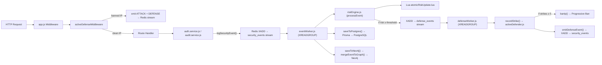
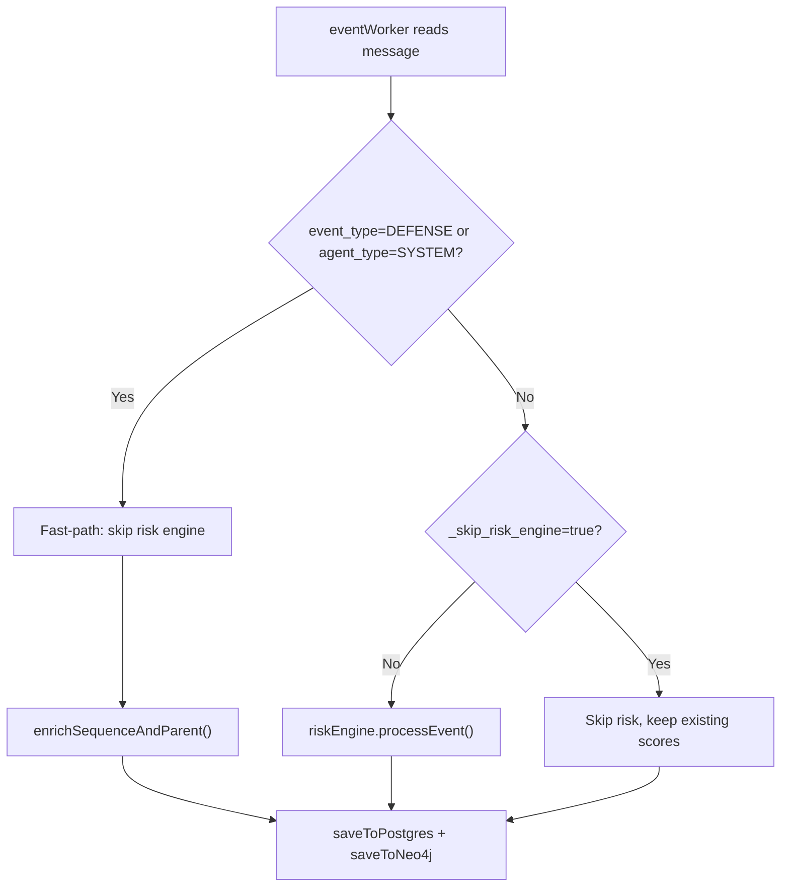

# Cloud-Native IAM Security Platform — Complete System Analysis

> **Source of truth**: Every query, metric, and data model below is reverse-engineered from actual code. No invented metrics. No generic examples.

---

## Table of Contents

1. [Architecture Explanation](#1-architecture-explanation)
2. [Event Schema & Evolution](#2-event-schema--evolution)
3. [Metric Mapping Table](#3-metric-mapping-table)
4. [Neo4j Data Model & Queries](#4-neo4j-data-model--queries)
5. [Prometheus Queries + Meaning](#5-prometheus-queries--meaning)
6. [Grafana Panel Design](#6-grafana-panel-design)
7. [Demo Explanation Script](#7-demo-explanation-script)

---

## 1. Architecture Explanation

### A. Pipeline Flow — End-to-End



#### Stage-by-Stage Breakdown

| Stage | File | What Happens | Data Added/Modified |
|-------|------|--------------|---------------------|
| **1. HTTP Ingress** | [app.js](file:///d:/cloud-iam-sec-platform/api/src/app.js#L36-L40) | Assigns `x-correlation-id` header (UUID or from request) | `req.correlationId` |
| **2. Ban Check** | [activeDefender.js](file:///d:/cloud-iam-sec-platform/api/src/shared/middleware/activeDefender.js#L325-L439) | Checks `ban:ip:<ip>` in Redis. If banned → emits ATTACK event + DEFENSE event, returns 403. | Emits 2 events with shared `correlation_id` |
| **3. Route Handler** | [auth.service.js](file:///d:/cloud-iam-sec-platform/api/src/modules/auth/auth.service.js) | Business logic (login, MFA, token refresh). On failures → calls `logSecurityEvent()` | `userId`, `action`, `status`, `sessionId` |
| **4. Event Emission** | [audit.service.js](file:///d:/cloud-iam-sec-platform/api/src/modules/auth/audit.service.js#L177-L309) | `logSecurityEvent()`: deduplicates (SHA-256 signature + SET NX 30s), classifies IP, emits ATTACK event first for hostile actions, then SECURITY event. Increments `security_events_ingested_total`. | `event_id`, `correlation_id`, `event_type`, `event_priority`, `agent_type`, `ip_type`, `stage`, `attack_category`, `event_signature`, `_skip_risk_engine` |
| **5. Stream Write** | [audit.service.js](file:///d:/cloud-iam-sec-platform/api/src/modules/auth/audit.service.js#L288-L294) | `XADD security_events MAXLEN ~10000 * data <JSON>` | Redis stream message ID |
| **6. Event Consumption** | [eventWorker.js](file:///d:/cloud-iam-sec-platform/api/workers/eventWorker.js#L722-L727) | `XREADGROUP GROUP audit_workers worker_<pid> COUNT 50 BLOCK 5000 STREAMS security_events >` | Message deserialized from stream |
| **7. Idempotency Gate** | [eventWorker.js](file:///d:/cloud-iam-sec-platform/api/workers/eventWorker.js#L477-L493) | Two-stage: `SET processed:<event_id> 1 EX 3600 NX` + `SET processing:<event_id> 1 EX 300 NX` mutex | Skips already-processed events |
| **8. Sequence Enrichment** | [eventWorker.js](file:///d:/cloud-iam-sec-platform/api/workers/eventWorker.js#L378-L435) | Assigns `event_sequence_index` (Redis INCR `seq:<correlation_id>`), `parent_event_id` (Redis GETSET `prev:<correlation_id>`), `event_priority` (ATTACK=1, DEFENSE=2) | `event_sequence_index`, `parent_event_id`, `event_priority` |
| **9. Risk Scoring** | [riskEngine.js](file:///d:/cloud-iam-sec-platform/api/workers/riskEngine.js#L287-L489) | Runs Lua script for atomic state update, computes multi-entity risk (IP + User + Session), applies time decay, pattern detection, severity weighting. Clamped to 0-100. | `risk_score`, `risk_level`, `risk_delta`, `sequence`, `is_defense_triggered`, `defense_reason`, `defense_action` |
| **10. Defense Dispatch** | [riskEngine.js](file:///d:/cloud-iam-sec-platform/api/workers/riskEngine.js#L209-L277) | If `score ≥ 60 OR delta > 20 OR patternScore ≥ 20` → XADD to `defense_events` with severity HIGH. If `score ≥ 85 OR patternScore ≥ 30` → additional CRITICAL entry. | `defense_events` stream populated with `dedup_key`, `source_ip`, `severity` |
| **11. Persistence** | [eventWorker.js](file:///d:/cloud-iam-sec-platform/api/workers/eventWorker.js#L224-L342) | `saveToPostgres()` → Prisma AuditLog with full metadata. `saveToNeo4j()` → `mergeEventToGraph()` single Cypher upsert. | PostgreSQL row, Neo4j graph nodes/edges |
| **12. Defense Execution** | [defenseWorker.js](file:///d:/cloud-iam-sec-platform/api/workers/defenseWorker.js#L233-L331) | XREADGROUP from `defense_events`, dedup via `SET defense:dedup:<key> 1 EX 600 NX`, calls `recordStrike()` | Strike recorded in Redis sorted set |
| **13. Strike → Ban** | [activeDefender.js](file:///d:/cloud-iam-sec-platform/api/src/shared/middleware/activeDefender.js#L178-L234) | ZSET sliding window (5min TTL). If strikes ≥ 5 → progressive ban (10m → 1h → 24h). Emits DEFENSE events back to `security_events` stream. | `ban:ip:<ip>`, `ban:meta:<ip>`, `strike:ip:<ip>` |

---

### B. DEFENSE vs ATTACK Fast-Path



> [!IMPORTANT]
> DEFENSE events are **never** risk-scored. This prevents circular amplification where a defense action would trigger more defense actions infinitely.

---

## 2. Event Schema & Evolution

### Base Event (emitted by `audit.service.js`)

| Field | Source | Example |
|-------|--------|---------|
| `event_id` | `crypto.randomUUID()` | `a1b2c3d4-...` |
| `correlation_id` | From payload or `crypto.randomUUID()` | `x9y8z7w6-...` |
| `event_type` | Resolved from metadata: `ATTACK`, `DEFENSE`, `SECURITY` | `ATTACK` |
| `event_priority` | `DEFENSE=2`, else `1` | `1` |
| `agent_type` | `EXTERNAL`, `SYSTEM`, `SIMULATED` | `EXTERNAL` |
| `action` | Business action: `LOGIN_FAILED`, `JWT_TAMPER`, `STRIKE_RECORDED`, etc. | `LOGIN_FAILED` |
| `source_ip` | From request or metadata | `192.168.1.50` |
| `ip_type` | `classifyIp()`: `REAL`, `SIMULATED`, etc. | `SIMULATED` |
| `severity` | `LOW`, `MEDIUM`, `HIGH`, `CRITICAL` | `MEDIUM` |
| `result` | `SUCCESS`, `FAILURE`, `BLOCKED`, `ALLOWED` | `FAILURE` |
| `timestamp` | ISO 8601 | `2026-04-05T10:30:00Z` |
| `stage` | `DETECTION`, `RESPONSE`, `ENFORCEMENT`, `null` | `DETECTION` |
| `attack_category` | `BRUTE_FORCE`, `SESSION_ATTACK`, `AUTHORIZATION_ATTACK`, `null` | `BRUTE_FORCE` |
| `_skip_risk_engine` | `true` when companion ATTACK already scored | `true` |
| `event_signature` | SHA-256 of `<event_type>:<action>:<ip>` | `a3f2b1...` |

### After eventWorker Enrichment

| Field Added | Source | Purpose |
|-------------|--------|---------|
| `event_sequence_index` | Redis `INCR seq:<correlation_id>` | Monotonic ordering within chain |
| `parent_event_id` | Redis `GETSET prev:<correlation_id>` | Links to previous event in chain |
| `event_priority` | `ATTACK=1, DEFENSE=2` | Deterministic sort key |

### After riskEngine Enrichment

| Field Added | Source | Purpose |
|-------------|--------|---------|
| `risk_score` | Multi-entity scoring (0-100) | Combined threat level |
| `risk_level` | `HIGH` (≥85), `MEDIUM` (≥60), `LOW` (<60) | Threshold classification |
| `risk_delta` | `entityTotal - previousScore` | Score change from last event |
| `sequence` | Last 5 event types (reversed) | Pattern detection context |
| `is_defense_triggered` | `true` if defense task was pushed | Defense activation flag |
| `defense_reason` | `risk_score_85_delta_30` | Human-readable trigger |
| `defense_action` | `STRIKE` or `ESCALATE` | Type of defense response |

---

## 3. Metric Mapping Table

### Pipeline Metrics (Event Flow)

| Metric Name | Type | Labels | File → Function | Pipeline Stage | Meaning |
|---|---|---|---|---|---|
| `security_events_ingested_total` | Counter | `event_type`, `action`, `source` | [audit.service.js:158](file:///d:/cloud-iam-sec-platform/api/src/modules/auth/audit.service.js#L158), [audit.service.js:296](file:///d:/cloud-iam-sec-platform/api/src/modules/auth/audit.service.js#L296) | Ingestion | Events written to Redis stream by the API process |
| `security_events_processed_total` | Counter | `action`, `event_type`, `severity`, `status` | [eventWorker.js:522-527](file:///d:/cloud-iam-sec-platform/api/workers/eventWorker.js#L522), [eventWorker.js:607-612](file:///d:/cloud-iam-sec-platform/api/workers/eventWorker.js#L607) | Processing | Events fully processed (DB + Neo4j write complete) |
| `defense_events_triggered_total` | Counter | `action`, `event_type`, `severity`, `status` | [riskEngine.js:251-256](file:///d:/cloud-iam-sec-platform/api/workers/riskEngine.js#L251), [riskEngine.js:266-271](file:///d:/cloud-iam-sec-platform/api/workers/riskEngine.js#L266) | Defense Dispatch | Defense tasks pushed to `defense_events` stream (success/error) |
| `events_processing_latency_ms` | Histogram | `worker` | [eventWorker.js:530](file:///d:/cloud-iam-sec-platform/api/workers/eventWorker.js#L530), [eventWorker.js:614](file:///d:/cloud-iam-sec-platform/api/workers/eventWorker.js#L614) | Processing | End-to-end latency: `now - event.timestamp` |
| `events_inflight_gauge` | Gauge | `worker` | [eventWorker.js:451](file:///d:/cloud-iam-sec-platform/api/workers/eventWorker.js#L451), [defenseWorker.js:234](file:///d:/cloud-iam-sec-platform/api/workers/defenseWorker.js#L234) | Processing | Currently in-flight messages per worker |
| `processing_backlog_size` | Gauge | `stream` | [eventWorker.js:717](file:///d:/cloud-iam-sec-platform/api/workers/eventWorker.js#L717), [defenseWorker.js:430](file:///d:/cloud-iam-sec-platform/api/workers/defenseWorker.js#L430) | Health | Pending messages in stream consumer group |

### Risk Engine Metrics

| Metric Name | Type | Labels | File → Function | Meaning |
|---|---|---|---|---|
| `risk_score_computed_total` | Counter | `action`, `event_type`, `severity`, `status` | [riskEngine.js:460-465](file:///d:/cloud-iam-sec-platform/api/workers/riskEngine.js#L460) | Total risk computations executed |
| `risk_score_distribution` | Histogram | _(none)_ | [riskEngine.js:466](file:///d:/cloud-iam-sec-platform/api/workers/riskEngine.js#L466) | Distribution of computed risk scores (buckets: 10-100) |
| `high_risk_events_total` | Counter | `risk_level`, `event_type`, `source` | [riskEngine.js:468](file:///d:/cloud-iam-sec-platform/api/workers/riskEngine.js#L468) | Events scoring HIGH or CRITICAL risk |
| `escalate_actions_total` | Counter | _(none)_ | [riskEngine.js:275](file:///d:/cloud-iam-sec-platform/api/workers/riskEngine.js#L275) | CRITICAL severity defense escalations |

### Defense System Metrics

| Metric Name | Type | Labels | File → Function | Meaning |
|---|---|---|---|---|
| `strikes_recorded_total` | Counter | `severity` | [activeDefender.js:200](file:///d:/cloud-iam-sec-platform/api/src/shared/middleware/activeDefender.js#L200) | Individual strikes recorded against IPs |
| `bans_triggered_total` | Counter | `severity`, `duration` | [activeDefender.js:297](file:///d:/cloud-iam-sec-platform/api/src/shared/middleware/activeDefender.js#L297) | IP bans applied (with duration: 10m/1h/24h) |
| `blocked_requests_total` | Counter | `reason` | [activeDefender.js:351](file:///d:/cloud-iam-sec-platform/api/src/shared/middleware/activeDefender.js#L351) | HTTP requests blocked by ban middleware |
| `active_bans_gauge` | Gauge | _(none)_ | [activeDefender.js:355](file:///d:/cloud-iam-sec-platform/api/src/shared/middleware/activeDefender.js#L354) | Current count of active IP bans (sampled) |
| `iam_ip_bans_total` | Counter | `reason`, `severity` | [activeDefender.js:276](file:///d:/cloud-iam-sec-platform/api/src/shared/middleware/activeDefender.js#L276) | IP bans by reason and severity |

### Neo4j Metrics

| Metric Name | Type | Labels | File → Function | Meaning |
|---|---|---|---|---|
| `neo4j_write_total` | Counter | `action`, `event_type`, `severity`, `status` | [eventWorker.js:310-323](file:///d:/cloud-iam-sec-platform/api/workers/eventWorker.js#L310) | Graph writes — success or error |
| `neo4j_write_latency_ms` | Histogram | _(none)_ | [eventWorker.js:309](file:///d:/cloud-iam-sec-platform/api/workers/eventWorker.js#L309) | Neo4j write operation latency |
| `neo4j_failed_events_queue_size` | Gauge | _(none)_ | [eventWorker.js:333](file:///d:/cloud-iam-sec-platform/api/workers/eventWorker.js#L333) | Events in `neo4j:failed_events` repair sorted set |

### Worker Health Metrics

| Metric Name | Type | Labels | File → Function | Meaning |
|---|---|---|---|---|
| `worker_alive_gauge` | Gauge | `worker` | [eventWorker.js:696](file:///d:/cloud-iam-sec-platform/api/workers/eventWorker.js#L696), [defenseWorker.js:409](file:///d:/cloud-iam-sec-platform/api/workers/defenseWorker.js#L409) | Heartbeat: 1 = alive |
| `worker_last_processed_timestamp` | Gauge | `worker` | [eventWorker.js:532](file:///d:/cloud-iam-sec-platform/api/workers/eventWorker.js#L532), [defenseWorker.js:307](file:///d:/cloud-iam-sec-platform/api/workers/defenseWorker.js#L307) | Epoch ms of last processed event |
| `redis_connection_status` | Gauge | _(none)_ | [eventWorker.js:703](file:///d:/cloud-iam-sec-platform/api/workers/eventWorker.js#L703) | Redis connectivity (1=connected) |
| `redis_stream_lag` | Gauge | `stream`, `group` | [eventWorker.js:716](file:///d:/cloud-iam-sec-platform/api/workers/eventWorker.js#L716), [defenseWorker.js:429](file:///d:/cloud-iam-sec-platform/api/workers/defenseWorker.js#L429) | Pending messages per consumer group |
| `dlq_size` | Gauge | `stream` | [defenseWorker.js:206](file:///d:/cloud-iam-sec-platform/api/workers/defenseWorker.js#L206) | Dead-letter queue depth |
| `retry_attempts_total` | Counter | `stream` | [eventWorker.js:652](file:///d:/cloud-iam-sec-platform/api/workers/eventWorker.js#L652), [defenseWorker.js:357](file:///d:/cloud-iam-sec-platform/api/workers/defenseWorker.js#L357) | PEL reclaim operations |

### Auth / Application Metrics

| Metric Name | Type | Labels | File → Function | Meaning |
|---|---|---|---|---|
| `iam_login_requests_total` | Counter | `status` | [auth.controller.js:102,107,125](file:///d:/cloud-iam-sec-platform/api/src/modules/auth/auth.controller.js) | Login attempts (success/failure/mfa_required) |
| `login_failures_total` | Counter | `status` | [auth.service.js:70,89](file:///d:/cloud-iam-sec-platform/api/src/modules/auth/auth.service.js#L70) | Failed login attempts |
| `mfa_failures_total` | Counter | _(none)_ | [auth.service.js:283](file:///d:/cloud-iam-sec-platform/api/src/modules/auth/auth.service.js#L283) | Invalid MFA code submissions |
| `distributed_mfa_lock_total` | Counter | _(none)_ | [auth.service.js:309](file:///d:/cloud-iam-sec-platform/api/src/modules/auth/auth.service.js#L309) | Per-user MFA lockouts triggered |
| `jwt_tamper_detected_total` | Counter | _(none)_ | [jwt.js:71](file:///d:/cloud-iam-sec-platform/api/src/shared/utils/jwt.js#L71) | JWT signature tampering detected |
| `iam_account_locks_total` | Counter | `reason` | [auth.service.js:106](file:///d:/cloud-iam-sec-platform/api/src/modules/auth/auth.service.js#L106) | Account lockouts by brute-force |
| `iam_session_security_events_total` | Counter | `event` | [auth.service.js:387,403,432,462,480](file:///d:/cloud-iam-sec-platform/api/src/modules/auth/auth.service.js#L387) | Token reuse, session compromise, hijack events |
| `iam_security_event_severity_total` | Counter | `severity` | [audit.service.js:285](file:///d:/cloud-iam-sec-platform/api/src/modules/auth/audit.service.js#L285) | Events by severity at ingestion |
| `iam_requests_total` | Counter | `method`, `route`, `status` | [app.js:149](file:///d:/cloud-iam-sec-platform/api/src/app.js#L149) | All HTTP requests |
| `iam_rate_limit_hits_total` | Counter | `type` | [rateLimiter.js:20,33,78,98](file:///d:/cloud-iam-sec-platform/api/src/shared/middleware/rateLimiter.js) | Rate limit triggers |
| `iam_auth_failures_total` | Counter | `reason` | [authenticate.js:16,27,52,71](file:///d:/cloud-iam-sec-platform/api/src/shared/middleware/authenticate.js) | Auth middleware rejections |
| `iam_authorization_failures_total` | Counter | `type` | [authorizeRoles.js:145](file:///d:/cloud-iam-sec-platform/api/src/shared/middleware/authorizeRoles.js#L145), [authorizePolicy.js:56,104](file:///d:/cloud-iam-sec-platform/api/src/shared/middleware/authorizePolicy.js) | RBAC/ABAC/IDOR denials |

---

## 4. Neo4j Data Model & Queries

### D. Data Model

#### Node Types (9)

| Label | Unique Key | Key Properties | Visual Color |
|-------|-----------|----------------|-------------|
| **Event** | `event_id` | `correlation_id`, `event_type`, `action`, `severity`, `risk_score`, `risk_level`, `event_priority`, `event_sequence_index`, `parent_event_id`, `timestamp` | Severity-based: 🔴`#EF4444` → 🟢`#22C55E` |
| **IP** | `address` | `ip_type`, `first_seen`, `last_seen`, `total_events` | `#60A5FA` (blue) |
| **User** | `user_id` OR `user_email` | `identity_source` (`uuid`/`email`) | `#A78BFA` (purple) |
| **Session** | `session_id` | `user_email`, `started_at` | `#34D399` (green) |
| **AttackGroup** | `correlation_id` | `attack_count`, `defense_count`, `first_seen`, `last_seen`, `mode` | `#F59E0B` (amber) |
| **AttackType** | `action` | `target_type`, `event_type`, `severity_max`, `severity_rank` | `#FB923C` (orange) |
| **Endpoint** | `path` | `target_type`, `hit_count` | `#38BDF8` (sky) |
| **DefenseAction** | `defense_type` | `mitigation_result`, `apply_count` | `#10B981` (emerald) |
| **RiskBucket** | `level` | — | Risk-level color |

#### Relationship Types (10)

| Relationship | Pattern | Properties | Meaning |
|-------------|---------|------------|---------|
| `TRIGGERED` | `(IP)-[:TRIGGERED]->(Event)` | — | IP originated this event |
| `ACTED` | `(User)-[:ACTED]->(Event)` | — | User performed this action |
| `CONTAINS` | `(Session)-[:CONTAINS]->(Event)` | — | Event occurred in this session |
| `GROUPS` | `(AttackGroup)-[:GROUPS]->(Event)` | `priority`, `sequence` | Event belongs to correlation chain |
| `OF_TYPE` | `(Event)-[:OF_TYPE]->(AttackType)` | — | Event classified as this technique |
| `TARGETED` | `(Event)-[:TARGETED]->(Endpoint)` | — | Event hit this API endpoint |
| `NEXT` | `(Event)-[:NEXT]->(Event)` | `sequence_delta`, `correlation_id` | Causal ordering within chain |
| `TRIGGERED_DEFENSE` | `(Event)-[:TRIGGERED_DEFENSE]->(Event)` | `correlation_id`, `correlation_confidence` | ATTACK caused this DEFENSE |
| `APPLIED` | `(Event)-[:APPLIED]->(DefenseAction)` | `blocked`, `reason`, `strike_count`, `ban_duration` | Defense action applied |
| `IN_RISK_BUCKET` | `(Event)-[:IN_RISK_BUCKET]->(RiskBucket)` | — | Event risk tier classification |

#### How Attack Chains Are Modeled

```
AttackGroup (correlation_id: "abc-123")
  │
  ├──[:GROUPS {priority:1, seq:1}]──► Event (LOGIN_FAILED, ATTACK, seq=1)
  │                                      │
  │                                      └──[:NEXT]──► Event (MFA_FAILED, ATTACK, seq=2)
  │                                                       │
  │                                                       └──[:NEXT]──► Event (STRIKE_RECORDED, DEFENSE, seq=3)
  │                                                                        │
  │                                                                        └──[:TRIGGERED_DEFENSE]
  │
  ├──[:GROUPS {priority:1, seq:2}]──► Event (MFA_FAILED)
  └──[:GROUPS {priority:2, seq:3}]──► Event (STRIKE_RECORDED)
```

- **`correlation_id`** groups all events in the same attack chain via `AttackGroup`
- **`event_sequence_index`** provides monotonic ordering (Redis INCR per correlation_id)
- **`parent_event_id`** + `NEXT` relationship creates the linked list
- **`event_priority`** ensures ATTACKs (1) sort before DEFENSEs (2) at the same sequence position

---

### Neo4j Queries (Cypher)

#### a. Attack Chain Tracing — Full sequence for a correlation_id

```cypher
MATCH (ag:AttackGroup {correlation_id: $correlationId})-[g:GROUPS]->(ev:Event)
OPTIONAL MATCH (ev)-[:OF_TYPE]->(at:AttackType)
OPTIONAL MATCH (ip:IP)-[:TRIGGERED]->(ev)
OPTIONAL MATCH (ev)-[:APPLIED]->(da:DefenseAction)
RETURN ev.event_id       AS event_id,
       ev.event_type     AS type,
       ev.action         AS action,
       ev.severity       AS severity,
       ev.risk_score     AS risk_score,
       ev.timestamp      AS timestamp,
       ip.address        AS source_ip,
       at.action         AS technique,
       da.defense_type   AS defense_applied,
       g.sequence        AS sequence_index,
       g.priority        AS priority
ORDER BY g.priority ASC, g.sequence ASC
```

**What it shows**: The complete timeline of an attack chain — every event, its risk score, the source IP, and any defense actions applied, in causal order.

**Why it matters**: During incident response, analysts need the full story. This reconstructs "attacker tried X, system detected Y, defense applied Z" in exact sequence.

---

#### b. High-Risk Nodes

```cypher
MATCH (rb:RiskBucket {level: 'HIGH'})<-[:IN_RISK_BUCKET]-(ev:Event)
OPTIONAL MATCH (ip:IP)-[:TRIGGERED]->(ev)
OPTIONAL MATCH (u:User)-[:ACTED]->(ev)
RETURN ev.event_id   AS event_id,
       ev.action     AS action,
       ev.risk_score AS risk_score,
       ev.severity   AS severity,
       ip.address    AS ip,
       u.user_email  AS user,
       ev.timestamp  AS when
ORDER BY ev.risk_score DESC
LIMIT 50
```

**What it shows**: Events that crossed the HIGH risk threshold (≥85), with their associated IPs and users.

**Why it matters**: Security analysts prioritize the highest-risk events. The `RiskBucket` node acts as a pre-filtered index — no full Event scan required.

---

#### c. Most Frequent Attack Paths (top attack sequences)

```cypher
MATCH (ag:AttackGroup)-[:GROUPS]->(ev:Event)
WHERE ev.event_type = 'ATTACK'
WITH ag.correlation_id AS chain,
     collect(ev.action ORDER BY ev.event_sequence_index) AS sequence,
     count(ev) AS depth,
     max(ev.risk_score) AS max_risk
RETURN sequence, count(*) AS frequency, avg(max_risk) AS avg_peak_risk, avg(depth) AS avg_depth
ORDER BY frequency DESC
LIMIT 10
```

**What it shows**: The most common attack patterns across all chains — e.g., `[LOGIN_FAILED, LOGIN_FAILED, MFA_FAILED]` appearing 47 times.

**Why it matters**: Reveals attacker playbooks. If the same sequence repeats, it's likely automated. Helps tune detection rules and risk weights.

---

#### d. Defense Effectiveness — Attack vs Defense ratio per chain

```cypher
MATCH (ag:AttackGroup)
WHERE ag.attack_count > 0
RETURN ag.correlation_id AS chain,
       ag.attack_count   AS attacks,
       ag.defense_count  AS defenses,
       CASE WHEN ag.attack_count > 0
            THEN toFloat(ag.defense_count) / ag.attack_count
            ELSE 0 END AS defense_ratio,
       ag.first_seen     AS started,
       ag.last_seen      AS ended
ORDER BY ag.attack_count DESC
LIMIT 25
```

**What it shows**: For each attack chain, how many attacks vs how many defense responses were generated. A `defense_ratio < 1.0` means some attacks went undefended.

**Why it matters**: Identifies gaps in the defense pipeline. If chains have 0 defenses, the risk thresholds may be too high, or the defense stream failed.

---

#### e. Lateral Movement / Multi-Step Attack Chains

```cypher
MATCH path = (first:Event)-[:NEXT*3..]->(last:Event)
WHERE first.event_type = 'ATTACK'
  AND last.event_type  = 'ATTACK'
  AND first.correlation_id = last.correlation_id
WITH first, last, length(path) AS chain_length,
     [n IN nodes(path) | n.action] AS actions,
     [n IN nodes(path) | n.risk_score] AS scores
WHERE chain_length >= 3
RETURN first.correlation_id AS chain,
       chain_length,
       actions,
       scores,
       last.risk_score - first.risk_score AS risk_escalation
ORDER BY risk_escalation DESC
LIMIT 20
```

**What it shows**: Multi-step attack chains (3+ hops) where risk escalated from start to end. E.g., `LOGIN_FAILED → MFA_FAILED → TOKEN_REUSE → JWT_TAMPER` with risk going from 20 → 95.

**Why it matters**: Multi-step chains are the hallmark of sophisticated attacks (credential stuffing → privilege escalation). Single-event detections miss these.

---

#### f. IP Threat Profile

```cypher
MATCH (ip:IP)-[:TRIGGERED]->(ev:Event)
WITH ip,
     count(ev) AS total_events,
     count(CASE WHEN ev.event_type = 'ATTACK' THEN 1 END) AS attack_count,
     collect(DISTINCT ev.action) AS techniques,
     max(ev.risk_score) AS peak_risk,
     count(DISTINCT ev.correlation_id) AS chain_count
WHERE attack_count > 0
RETURN ip.address     AS ip,
       total_events,
       attack_count,
       techniques,
       peak_risk,
       chain_count,
       ip.first_seen  AS first_seen,
       ip.last_seen   AS last_seen
ORDER BY attack_count DESC
LIMIT 20
```

**What it shows**: Top attacking IPs with their technique repertoire, peak risk score, and how many separate attack chains they initiated.

---

#### g. Defense Action Distribution

```cypher
MATCH (da:DefenseAction)<-[:APPLIED]-(ev:Event)
OPTIONAL MATCH (ip:IP)-[:TRIGGERED]->(ev)
RETURN da.defense_type AS defense_type,
       da.apply_count  AS total_applications,
       collect(DISTINCT ip.address) AS affected_ips,
       count(DISTINCT ev.correlation_id) AS chains_defended
ORDER BY total_applications DESC
```

**What it shows**: Which defense actions (STRIKE, BAN, BLOCK) fired most, against which IPs, across how many chains.

---

#### h. Endpoint Under Attack

```cypher
MATCH (ep:Endpoint)<-[:TARGETED]-(ev:Event {event_type: 'ATTACK'})
RETURN ep.path      AS endpoint,
       ep.hit_count AS total_hits,
       count(ev)    AS attack_events,
       collect(DISTINCT ev.action) AS attack_types,
       max(ev.risk_score) AS peak_risk
ORDER BY attack_events DESC
LIMIT 10
```

**What it shows**: Most-attacked API endpoints with the types of attacks they receive.

---

## 5. Prometheus Queries + Meaning

### a. Ingestion vs Processing (Pipeline Health)

```promql
# Ingestion rate (events entering the stream)
sum(rate(security_events_ingested_total[5m]))

# Processing rate (events fully processed by eventWorker)
sum(rate(security_events_processed_total{status="success"}[5m]))

# GAP = potential backlog building
sum(rate(security_events_ingested_total[5m]))
  -
sum(rate(security_events_processed_total{status="success"}[5m]))
```

**What it measures**: The delta between events entering `security_events` stream and events leaving it as processed. A growing gap means the worker is falling behind.

**Pipeline stage**: Ingestion (audit.service.js) → Processing (eventWorker.js)

---

### b. Risk Engine Load

```promql
# Risk computations per second
sum(rate(risk_score_computed_total[5m]))

# Risk score p95
histogram_quantile(0.95, sum(rate(risk_score_distribution_bucket[5m])) by (le))

# High-risk event rate
sum(rate(high_risk_events_total[5m])) by (risk_level)
```

**What it measures**: How actively the risk engine is computing scores, the 95th-percentile score being generated, and how often HIGH/CRITICAL events are being flagged.

**Pipeline stage**: riskEngine.js → `processEvent()` → after Lua script execution

---

### c. Defense Trigger Rate

```promql
# Defense tasks queued per second
sum(rate(defense_events_triggered_total{status="success"}[5m]))

# Defense escalations (CRITICAL severity)
rate(escalate_actions_total[5m])

# Strikes vs Bans ratio
sum(rate(strikes_recorded_total[5m])) / sum(rate(bans_triggered_total[5m]))
```

**What it measures**: How often the risk engine pushes defense tasks, how often it escalates to CRITICAL, and the ratio of strikes to bans (should be ~5:1 given the 5-strike threshold).

**Pipeline stage**: riskEngine._pushDefenseTask() → defenseWorker → activeDefender.recordStrike()

---

### d. Failure Visibility (Error Rates)

```promql
# Neo4j write error rate
sum(rate(neo4j_write_total{status="error"}[5m]))

# Defense dispatch failures
sum(rate(defense_events_triggered_total{status="error"}[5m]))

# Dead-letter queue growth
dlq_size

# Neo4j repair queue
neo4j_failed_events_queue_size
```

**What it measures**: Errors across the pipeline — Neo4j write failures, defense stream write failures, and the depth of the DLQ and repair queues.

**Pipeline stage**: eventWorker.saveToNeo4j() error path, riskEngine._pushDefenseTask() error path

---

### e. Worker Health

```promql
# Worker heartbeat (if 0 for > 30s, worker is dead)
worker_alive_gauge

# Time since last processed event (detect stuck workers)
time() * 1000 - worker_last_processed_timestamp

# Events currently in-flight
events_inflight_gauge

# Redis connection status
redis_connection_status

# Stream consumer lag (backlog)
redis_stream_lag
```

**What it measures**: Whether each worker process is alive, how long since it processed anything (detect stalls), in-flight count (detect hangs), and Redis connectivity.

**Pipeline stage**: Main loop of eventWorker.js and defenseWorker.js

---

### f. Attack Detection Rate

```promql
# Attacks by type
sum(rate(security_events_ingested_total{event_type="ATTACK"}[5m])) by (action)

# Login failures causing lockouts
rate(iam_account_locks_total[5m])

# JWT tampering attempts
rate(jwt_tamper_detected_total[5m])

# Session compromise events
sum(rate(iam_session_security_events_total[5m])) by (event)
```

**What it measures**: Real-time attack signals directly from the application layer — which attack types are active and at what rate.

**Pipeline stage**: auth.service.js, authenticate.js, jwt.js — the application layer before events enter the stream

---

### g. Blocked Request rate (Active Defense Effectiveness)

```promql
# Requests blocked by ban middleware
sum(rate(blocked_requests_total[5m])) by (reason)

# Currently active bans
active_bans_gauge

# Ban breakdown by duration
sum(rate(bans_triggered_total[5m])) by (duration)
```

**What it measures**: How many inbound HTTP requests the ban middleware is rejecting, how many bans are currently active, and the severity distribution of bans (10m vs 1h vs 24h).

**Pipeline stage**: activeDefenseMiddleware in app.js → activeDefender.js

---

## 6. Grafana Panel Design

### Dashboard 1: System Overview (SRE View)

| # | Panel Title | Query | Type | Insight |
|---|------------|-------|------|---------|
| 1 | **Pipeline Throughput** | `sum(rate(security_events_ingested_total[1m]))` vs `sum(rate(security_events_processed_total{status="success"}[1m]))` | Time Series (dual axis) | Are we keeping up? Two lines should track. Divergence = backlog. |
| 2 | **Processing Latency (p50/p95/p99)** | `histogram_quantile(X, sum(rate(events_processing_latency_ms_bucket{worker="eventWorker"}[5m])) by (le))` for X ∈ {0.5, 0.95, 0.99} | Time Series | How fast are events being processed? p95 > 1000ms = risk engine overloaded. |
| 3 | **Stream Consumer Lag** | `redis_stream_lag` | Time Series | Per-stream backlog. Spike = worker crash or Redis slowdown. |
| 4 | **Worker Status** | `worker_alive_gauge` | Stat (2 panels: eventWorker, defenseWorker) | Green=1, Red=0. Instant visibility of worker health. |
| 5 | **Dead Letter Queue** | `dlq_size` | Stat with thresholds (green=0, red≥1) | Any value > 0 means events are permanently failing. Requires investigation. |
| 6 | **Neo4j Write Error Rate** | `rate(neo4j_write_total{status="error"}[5m])` | Time Series | Graph database health. Spikes correlate with Neo4j connection issues. |
| 7 | **Redis Connection** | `redis_connection_status` | Stat | Infrastructure dependency check. 0 = Redis down = full pipeline halt. |

**Story**: "An SRE opens this dashboard and immediately sees: pipeline is flowing (panel 1), latency is normal (panel 2), no backlog (panel 3), both workers alive (panel 4), no dead letters (panel 5), Neo4j healthy (panel 6), Redis connected (panel 7). If any panel goes red, they know exactly where to look."

---

### Dashboard 2: Security Analytics (Security Analyst View)

| # | Panel Title | Query | Type | Insight |
|---|------------|-------|------|---------|
| 1 | **Attacks by Type** | `sum(rate(security_events_ingested_total{event_type="ATTACK"}[5m])) by (action)` | Time Series (stacked) | Which attack types are active right now? Sudden spike in `LOGIN_FAILED` = brute force campaign. |
| 2 | **Risk Score Distribution (p90)** | `histogram_quantile(0.90, sum(rate(risk_score_distribution_bucket[5m])) by (le))` | Time Series | The "danger level" of the system. p90 rising = coordinated attack in progress. |
| 3 | **High-Risk Events** | `sum(rate(high_risk_events_total[5m])) by (risk_level)` | Time Series | HIGH vs CRITICAL risk events over time. Alerts on sustained CRITICAL rate. |
| 4 | **Login Failures** | `rate(login_failures_total[1m])` | Time Series | Raw brute-force pressure on the login endpoint. |
| 5 | **MFA Brute Force** | `rate(mfa_failures_total[5m])` | Time Series | MFA code guessing attempts. Combined with `distributed_mfa_lock_total` shows distributed attacks. |
| 6 | **JWT Tampering** | `rate(jwt_tamper_detected_total[5m])` | Time Series | Token manipulation attempts — indicates sophisticated attacker. |
| 7 | **Session Compromise Events** | `sum(rate(iam_session_security_events_total[5m])) by (event)` | Bar gauge | Breakdown: token_reuse, session_compromised, session_hijack, token_race. |
| 8 | **Severity Distribution** | `sum(rate(iam_security_event_severity_total[5m])) by (severity)` | Pie chart | LOW/MEDIUM/HIGH/CRITICAL proportions. Healthy system is mostly LOW. |

**Story**: "A security analyst opens this and sees a spike in `LOGIN_FAILED` attacks (panel 1), risk scores climbing to p90=75 (panel 2), HIGH-risk events appearing (panel 3). They click into Neo4j Browser to trace the correlation_id and find a distributed brute-force campaign."

---

### Dashboard 3: Defense Effectiveness (Operations View)

| # | Panel Title | Query | Type | Insight |
|---|------------|-------|------|---------|
| 1 | **Strike Rate by Severity** | `sum(rate(strikes_recorded_total[5m])) by (severity)` | Time Series (stacked) | Volume of strikes being issued. HIGH/CRITICAL spikes = active defense engaging. |
| 2 | **Bans Triggered** | `sum(rate(bans_triggered_total[5m])) by (severity)` | Time Series | Ban activation rate. Should follow strikes with ~5:1 ratio (5-strike threshold). |
| 3 | **Active IP Bans** | `active_bans_gauge` | Stat (big number) | Current enforcement posture. High number = active attack being mitigated. |
| 4 | **Blocked Requests** | `sum(rate(blocked_requests_total[5m])) by (reason)` | Time Series | Requests being rejected at the edge. Shows defense is actively protecting the system. |
| 5 | **Defense Pipeline Health** | `sum(rate(defense_events_triggered_total{status="success"}[5m]))` vs `sum(rate(defense_events_triggered_total{status="error"}[5m]))` | Time Series | Success vs failure of defense task dispatch. Any errors = alerts to engineering. |
| 6 | **Ban Duration Distribution** | `sum(bans_triggered_total) by (duration)` | Bar chart | 10m vs 1h vs 24h bans — shows escalation pattern. Lots of 24h = persistent attackers. |
| 7 | **Escalation Rate** | `rate(escalate_actions_total[5m])` | Stat | CRITICAL escalations. Any sustained rate > 0 = serious ongoing attack. |

**Story**: "An operator sees strikes climbing (panel 1), bans triggering (panel 2), 12 active bans (panel 3), and 200 blocked requests/min (panel 4). The defense pipeline is healthy — no errors (panel 5). The system is autonomously mitigating a brute-force campaign."

---

## 7. Demo Explanation Script

### 🎬 System Introduction

> "This platform is a **Cloud-Native IAM (Identity and Access Management) Security System** that detects, analyzes, and autonomously responds to authentication attacks in real-time."

### 1. What Problem Are We Solving?

> "Real-world IAM systems face constant attack: credential stuffing (automated login attempts with leaked databases), MFA bypass attempts, JWT token tampering, session hijacking, and privilege escalation. Traditional systems log these events but don't **respond** — they require human analysts to notice the pattern and manually ban the attacker."
>
> "Our platform closes that gap. It **detects attacks as they happen**, **computes real-time risk scores** that account for attack patterns and history, and **autonomously defends** by issuing progressive bans — all while maintaining a full **attack graph** in Neo4j for forensic investigation."

### 2. How The System Detects Attacks

> "When an attacker sends a login request with invalid credentials, the Express API processes it through the auth service. The `logSecurityEvent()` function in `audit.service.js` does three things:"
>
> 1. "**Deduplicates** — SHA-256 hash of `type:action:ip` with a 30-second Redis SET NX window prevents flooding."
> 2. "**Emits an ATTACK event** — For hostile actions like `LOGIN_FAILED`, `MFA_FAILED`, or `JWT_TAMPER`, a companion `ATTACK` event is emitted first to the Redis stream, establishing it as the chain's root."
> 3. "**Emits the SECURITY event** — The original event follows, tagged with `_skip_risk_engine: true` so it won't be double-scored."
>
> "Both events share the same `correlation_id`, creating a causal chain."

### 3. How The System Scores Risk

> "The `eventWorker` picks up events from the `security_events` Redis stream using consumer groups (at-least-once delivery). For ATTACK events, it invokes the `riskEngine`."
>
> "The risk engine runs a **Lua script atomically in Redis** to update per-entity state (IP, User, Session). It computes a risk score (0-100) using:"
>
> - "**Event weights**: `JWT_TAMPER=20`, `PASSWORD_BRUTE=15`, `LOGIN_FAILED=5`, `LOGIN_SUCCESS=-10`"
> - "**Time decay**: `score × e^(-0.05 × minutes)` — old events matter less"
> - "**Pattern detection**: Sequences like `[MFA_FAILED, LOGIN_FAILED]` add +15; `[TOKEN_REUSE, MFA_FAILED, LOGIN_FAILED]` adds +30"
> - "**Severity weights**: CRITICAL=+25, HIGH=+15, MEDIUM=+8, LOW=+2"
>
> "When the score crosses **60** (or delta > 20, or pattern score ≥ 20), a defense task is pushed to the `defense_events` stream with severity HIGH. At **85**, a CRITICAL escalation follows."

### 4. How The System Responds

> "The `defenseWorker` reads from `defense_events` and calls `recordStrike()` in the active defender. Strikes are tracked in a Redis sorted set with a 5-minute sliding window."
>
> "After **5 strikes**, the IP is **banned** with progressive escalation:"
> | Ban # | Duration |
> |-------|----------|
> | 1st | 10 minutes |
> | 2nd | 1 hour |
> | 3rd+ | 24 hours |
>
> "Each strike and ban emits a **DEFENSE event** back to the `security_events` stream, which the eventWorker processes (but **skips risk scoring** — fast-path for `agent_type=SYSTEM`). This creates the full ATTACK → DEFENSE chain in Neo4j."
>
> "Banned IPs are checked at the **HTTP middleware layer** (`activeDefenseMiddleware`). When a banned IP sends a request, it's rejected with 403 before it even reaches the route handler."

### 5. How Observability Works

#### Prometheus → SRE / Backend Engineers

> "Prometheus scrapes three endpoints every 5 seconds:"
> - "`backend:3000/metrics` — API-level metrics (login counters, rate limits, auth failures)"
> - "`worker:9091/metrics` — eventWorker metrics (processing rates, Neo4j writes, risk computations)"
> - "`defense_worker:9092/metrics` — defenseWorker metrics (strikes, bans, defense queue lag)"
>
> "These tell SREs: **is the pipeline healthy?** Is the worker keeping up? Are there Neo4j write errors? Is the DLQ growing?"

#### Grafana → Operators / Security Analysts

> "Grafana visualizes the Prometheus data across three dashboards:"
> - "**System Overview** — Pipeline throughput, latency, worker health. The SRE's heartbeat monitor."
> - "**Security Analytics** — Attack types, risk score trends, MFA brute force, JWT tampering. The analyst's threat radar."
> - "**Defense Effectiveness** — Strikes, bans, blocked requests. Shows the autonomous defense is working."
>
> "Each panel tells a specific story. Together they answer: *What's attacking us? How bad is it? Is our defense working?*"

#### Neo4j → Security Analysts / Incident Investigators

> "Neo4j stores the **attack graph** — every event as a node, with relationships showing causality:"
> - "`IP → TRIGGERED → Event` — who did it"
> - "`Event → NEXT → Event` — what happened next (causal chain)"
> - "`Event → TRIGGERED_DEFENSE → Event` — what defense responded"
> - "`AttackGroup → GROUPS → Event` — full correlation chain"
>
> "Analysts use Cypher queries to trace attack chains, find the most-attacked endpoints, identify lateral movement patterns, and verify that defenses engaged correctly."

---

### 🎯 Full Demo Narrative

> **Scene**: An attacker starts a distributed brute-force campaign against the login endpoint.

```
Timeline:

T+0s    Attacker sends 3 LOGIN_FAILED from 192.168.50.10
        → audit.service emits ATTACK events → security_events stream
        → security_events_ingested_total{action="LOGIN_FAILED"} jumps
        
T+2s    eventWorker picks up events
        → riskEngine scores IP:192.168.50.10 → score rises from 0 → 35
        → risk_score_computed_total increments
        → Neo4j: 3 Event nodes linked by NEXT, grouped under AttackGroup
        
T+5s    Attacker sends 5 more LOGIN_FAILED + 2 MFA_FAILED
        → riskEngine scores → score jumps to 72 (pattern [MFA_FAILED, LOGIN_FAILED] +15)
        → Crosses threshold 60 → defense task pushed to defense_events
        → defense_events_triggered_total{severity="HIGH"} increments
        
T+7s    defenseWorker reads defense task
        → recordStrike("192.168.50.10", "HIGH")
        → strikes_recorded_total increments
        → DEFENSE event (STRIKE_RECORDED) emitted back to stream
        → Neo4j: STRIKE_RECORDED node linked via TRIGGERED_DEFENSE
        
T+12s   More attacks → score reaches 89 (CRITICAL)
        → CRITICAL defense dispatched + escalated
        → escalate_actions_total increments
        → 5th strike → banIp() fires → 10-minute ban
        → bans_triggered_total{severity="CRITICAL", duration="10m"} increments
        → active_bans_gauge = 1
        
T+13s   Attacker's next request hits activeDefenseMiddleware
        → ban:ip:192.168.50.10 exists → 403 returned
        → blocked_requests_total increments
        → ATTACK(BLOCKED_REQUEST) + DEFENSE(BLOCKED_BANNED_IP) events emitted
        
T+15s   Grafana shows:
        → Dashboard 1: Processed events spike, latency normal
        → Dashboard 2: LOGIN_FAILED attack spike, risk p90 = 85
        → Dashboard 3: Strikes → Ban → Blocked requests
        
T+20s   Analyst opens Neo4j Browser:
        → Queries AttackGroup by correlation_id
        → Sees: LOGIN_FAILED → LOGIN_FAILED → MFA_FAILED → STRIKE_RECORDED → IP_BANNED → BLOCKED_REQUEST
        → Full attack chain visualized as a graph with color-coded severity
        → IP node shows total_events=12, linked to AttackType nodes [LOGIN_FAILED, MFA_FAILED]
```

> **The result**: The system detected the attack within seconds, scored the risk across multiple dimensions, autonomously banned the attacker, and left a complete forensic trail in the graph database — all without human intervention.

---

> [!TIP]
> **Key differentiators to emphasize in interviews:**
> 1. **Stream-based architecture** — Redis Streams with consumer groups provide at-least-once delivery, PEL-based retry, and XAUTOCLAIM for crash recovery
> 2. **Atomic risk scoring** — Lua script in Redis ensures no race conditions in score computation
> 3. **Deterministic ordering** — `event_priority` + `event_sequence_index` + `parent_event_id` guarantee causal chain reconstruction
> 4. **Idempotent everything** — Neo4j MERGEs, Redis SET NX gates, DB dedup checks — safe under re-delivery
> 5. **No circular amplification** — DEFENSE events are fast-pathed (skip risk engine), SYSTEM agent_type is the canonical guard
> 6. **Progressive defense** — Not just one ban — 10min → 1h → 24h escalation with per-IP sliding-window strike decay
