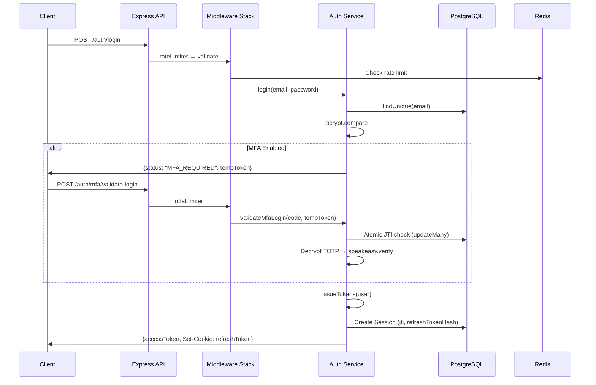
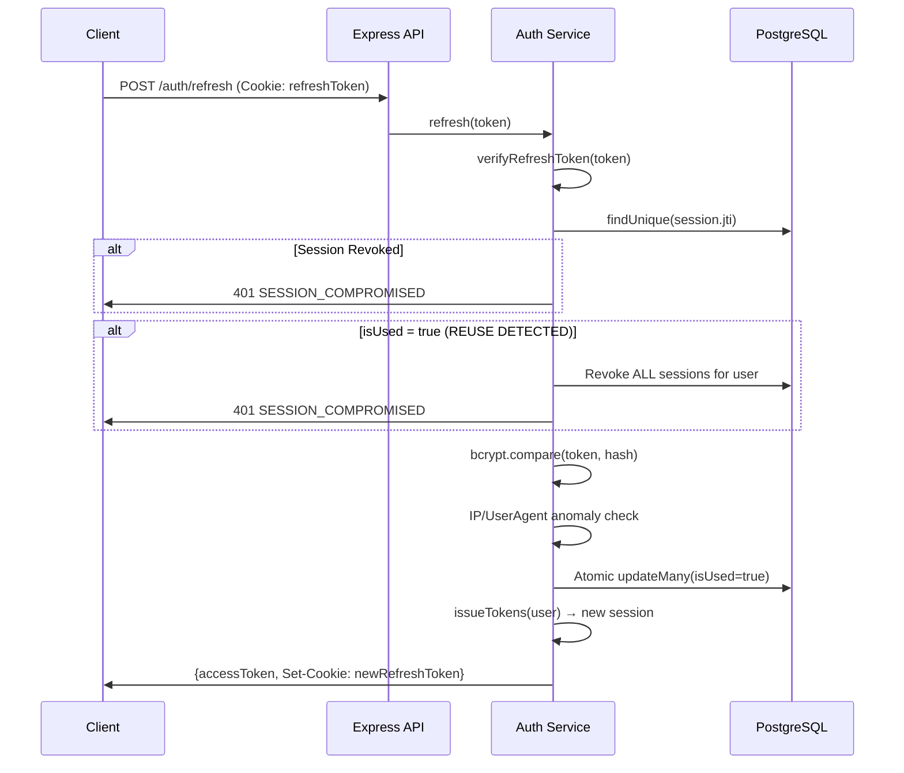
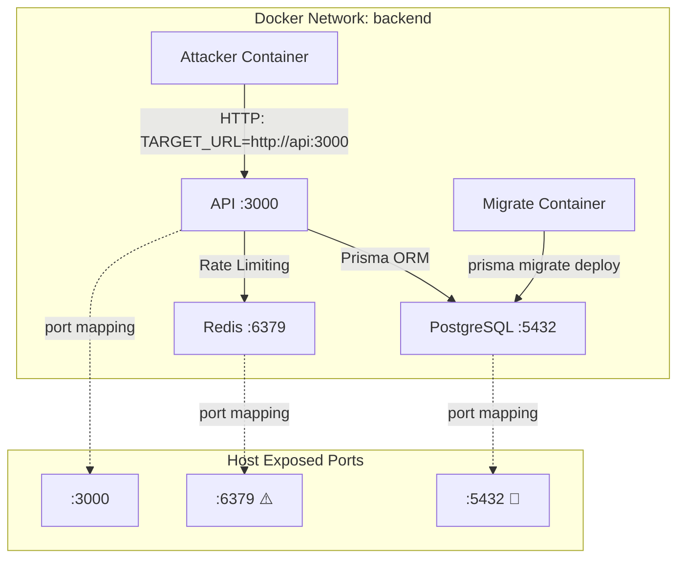

# 🔒 Cloud-Native IAM Security Platform — Complete Audit Report

**Audit Date:** 2026-03-30
**Auditor:** Antigravity Security Audit Engine
**Scope:** Full codebase — API, Simulation Engine, Infrastructure, Graph Logging
**Classification:** CONFIDENTIAL — Production-Grade Security Audit

---

## 1. Executive Summary

This platform is a **well-architected but partially-complete** IAM security system with genuinely strong fundamentals. The Node.js backend demonstrates mature security engineering patterns (refresh token rotation with reuse detection, ABAC+RBAC layering, MFA with encrypted TOTP secrets, alg:none JWT defense). The Rust attack simulation engine is comprehensive with 11 modular attacks and produces structured JSON reports with GraphEvent logging.

**However, the audit reveals 19 security findings** (3 Critical, 5 High, 7 Medium, 4 Low) that must be addressed before any production deployment. The most severe issues are: **secrets committed to source control** (.env with real Google OAuth credentials + encryption keys), **database port exposed to host**, and a **timing-safe comparison bypass** in internal service auth.

| Category | Rating |
|---|---|
| IAM Core (Auth/RBAC/Token/Session) | ⭐⭐⭐⭐ Strong |
| API Security | ⭐⭐⭐ Good |
| Container Security | ⭐⭐ Needs Work |
| Attack Engine | ⭐⭐⭐⭐ Strong |
| Graph/Neo4j Readiness | ⭐⭐⭐ Needs Normalization |
| Observability | ⭐⭐ Minimal |
| Production Readiness | ⭐⭐ Not Ready |

---

## 2. Feature Inventory

### IAM Core

| Feature | Status | File(s) | Notes |
|---|---|---|---|
| User Registration | ✅ Fully implemented | [auth.service.js](file:///d:/cloud-iam-sec-platform/api/src/modules/auth/auth.service.js#L23-L50) | Email normalization, bcrypt hashing, duplicate check |
| Login (email/password) | ✅ Fully implemented | [auth.service.js](file:///d:/cloud-iam-sec-platform/api/src/modules/auth/auth.service.js#L55-L129) | Anti-enumeration timing, account lockout |
| Google OAuth / OIDC | ✅ Fully implemented | [googleAuth.service.js](file:///d:/cloud-iam-sec-platform/api/src/modules/auth/googleAuth.service.js) | Account takeover fix applied |
| JWT Access Tokens | ✅ Fully implemented | [jwt.js](file:///d:/cloud-iam-sec-platform/api/src/shared/utils/jwt.js) | HS256, issuer/audience, structural pre-validation |
| JWT Refresh Tokens | ✅ Fully implemented | [auth.service.js](file:///d:/cloud-iam-sec-platform/api/src/modules/auth/auth.service.js#L271-L401) | Rotation, reuse detection, bcrypt hash storage |
| MFA (TOTP) | ✅ Fully implemented | [mfa.service.js](file:///d:/cloud-iam-sec-platform/api/src/modules/auth/mfa.service.js) | AES-256-GCM encrypted secrets, key versioning |
| Session Management | ✅ Fully implemented | [auth.service.js](file:///d:/cloud-iam-sec-platform/api/src/modules/auth/auth.service.js#L460-L527) | List, revoke single, revoke all, max-session cap |
| Account Lockout | ✅ Fully implemented | [auth.service.js](file:///d:/cloud-iam-sec-platform/api/src/modules/auth/auth.service.js#L69-L115) | 5-attempt threshold, session revocation on lock |
| RBAC | ✅ Fully implemented | [authorizeRoles.js](file:///d:/cloud-iam-sec-platform/api/src/shared/middleware/authorizeRoles.js) | Role hierarchy (ADMIN > SECURITY_ANALYST > USER) |
| ABAC / Policy Engine | ✅ Fully implemented | [policyEngine.js](file:///d:/cloud-iam-sec-platform/api/src/modules/auth/policyEngine.js), [policies.js](file:///d:/cloud-iam-sec-platform/api/src/modules/auth/policies.js) | Condition-based, resource-aware |
| User CRUD | ✅ Fully implemented | [user.service.js](file:///d:/cloud-iam-sec-platform/api/src/modules/user/user.service.js) | Paginated list, self-change protection |

### Security Modules

| Feature | Status | File(s) | Notes |
|---|---|---|---|
| Rate Limiting (Redis-backed) | ✅ Fully implemented | [rateLimiter.js](file:///d:/cloud-iam-sec-platform/api/src/shared/middleware/rateLimiter.js) | 4 tiers: API, Auth, MFA, Internal |
| Input Validation | ✅ Fully implemented | [validate.js](file:///d:/cloud-iam-sec-platform/api/src/shared/middleware/validate.js) | express-validator, registration/login/role rules |
| Helmet (Security Headers) | ✅ Fully implemented | [app.js](file:///d:/cloud-iam-sec-platform/api/src/app.js#L55-L66) | CSP, XSS protection |
| CORS | ✅ Fully implemented | [app.js](file:///d:/cloud-iam-sec-platform/api/src/app.js#L71-L78) | Whitelist-based, credentials enabled |
| HPP Protection | ✅ Fully implemented | [app.js](file:///d:/cloud-iam-sec-platform/api/src/app.js#L95) | HTTP parameter pollution |
| Cookie Security | ✅ Fully implemented | [auth.controller.js](file:///d:/cloud-iam-sec-platform/api/src/modules/auth/auth.controller.js#L7-L12) | httpOnly, secure, sameSite:strict |
| Zero Trust (Internal Auth) | ✅ Fully implemented | [internalAuth.js](file:///d:/cloud-iam-sec-platform/api/src/shared/middleware/internalAuth.js) | Token-based S2S auth |
| Encryption (AES-256-GCM) | ✅ Fully implemented | [cipher.js](file:///d:/cloud-iam-sec-platform/api/src/shared/utils/cipher.js) | Key versioning, strict validation |
| Audit Logging | ⚠️ Partial | [audit.service.js](file:///d:/cloud-iam-sec-platform/api/src/modules/auth/audit.service.js) | DB audit log exists, but not on all sensitive ops |
| CSRF Protection | ⚠️ Partial | Cookie-based | SameSite=strict helps, but no CSRF token mechanism |

### Attack Simulation Engine

| Feature | Status | File(s) | Notes |
|---|---|---|---|
| Attack Orchestrator | ✅ Fully implemented | [main.rs](file:///d:/cloud-iam-sec-platform/simulation-engine/cloudshield-attacker/src/main.rs) | 11 attacks, per-attack identity isolation |
| HTTP Client Library | ✅ Fully implemented | [client.rs](file:///d:/cloud-iam-sec-platform/simulation-engine/cloudshield-attacker/src/client.rs) | Generic auth/unauth requests, cookie handling |
| Report Generation | ✅ Fully implemented | [main.rs](file:///d:/cloud-iam-sec-platform/simulation-engine/cloudshield-attacker/src/main.rs#L717-L735) | Structured JSON + GraphEvents |
| GraphEvent Logging | ⚠️ Partial | [main.rs](file:///d:/cloud-iam-sec-platform/simulation-engine/cloudshield-attacker/src/main.rs#L74-L92) | Summary-level only, inline in main.rs |

### Infrastructure

| Feature | Status | File(s) | Notes |
|---|---|---|---|
| Docker (API) | ✅ Fully implemented | [Dockerfile](file:///d:/cloud-iam-sec-platform/api/Dockerfile) | Multi-stage, non-root user, dumb-init |
| Docker (Attacker) | ✅ Fully implemented | [Dockerfile](file:///d:/cloud-iam-sec-platform/simulation-engine/cloudshield-attacker/Dockerfile) | Multi-stage Rust build, slim runtime |
| Docker Compose | ✅ Fully implemented | [docker-compose.yml](file:///d:/cloud-iam-sec-platform/api/docker-compose.yml) | 5 services, health checks, dependency ordering |
| Database Migrations | ✅ Fully implemented | migrate service | Prisma deploy in Docker |
| Database Seeding | ✅ Fully implemented | [seed.js](file:///d:/cloud-iam-sec-platform/api/prisma/seed.js) | 3 role accounts, env-based passwords |
| Kubernetes | ❌ Missing | — | Not implemented |
| React Frontend | ❌ Missing | — | Not implemented |
| Neo4j Integration | ❌ Missing | — | GraphEvents exist but no consumer |
| Prometheus/Grafana | ❌ Missing | — | No metrics endpoint |

---

## 3. Architecture & Data Flow

### Core Authentication Flow



### Token Refresh + Rotation Flow



### Container Communication Flow



### Missing Connections

> [!WARNING]
> **Attack → Logging → Analysis pipeline is broken.** GraphEvents are generated during attacks and written to `results.json`, but there is no consumer. No Neo4j ingestion, no API endpoint to query graph events, and no dashboard to visualize attack paths.

> [!WARNING]
> **No Frontend exists.** The platform has no React frontend — all testing happens via curl/Postman or the attack engine.

---

## 4. Security Findings

### 🔴 CRITICAL — SEC-01: Secrets Committed to Source Control

**File:** [.env](file:///d:/cloud-iam-sec-platform/api/.env)

The `.env` file is tracked in Git and contains:
- **Google OAuth Client Secret** (`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`) — line 42
- **AES-256 Encryption Keys** (v1, v2) — lines 46-47
- **Seed passwords** — lines 37-39
- **JWT secrets** (placeholder but still committed) — lines 18, 21

**Exploit:** Anyone with repo access can extract the Google OAuth secret and sign into your Google OIDC flow as any user, decrypt all TOTP secrets using the encryption keys, or forge JWTs if placeholders are used in production.

**Fix:** Add `.env` to `.gitignore` immediately. Rotate ALL secrets. Use a vault (e.g., HashiCorp Vault, AWS Secrets Manager).

---

### 🔴 CRITICAL — SEC-02: PostgreSQL Port Exposed to Host

**File:** [docker-compose.yml](file:///d:/cloud-iam-sec-platform/api/docker-compose.yml#L28-L29)

```yaml
ports:
  - '5432:5432'  # 🔴 Database accessible from host network
```

**Exploit:** Any process on the host or any attacker with network access can connect directly to PostgreSQL with the default `postgres:postgres` credentials (also in `.env`), bypassing all API authentication, RBAC, rate limiting, and audit logging.

**Fix:** Remove the host port mapping. Database should only be accessible within the Docker network.

---

### 🔴 CRITICAL — SEC-03: Internal Service Token Comparison Vulnerable to Timing Attack

**File:** [internalAuth.js](file:///d:/cloud-iam-sec-platform/api/src/shared/middleware/internalAuth.js#L69)

```javascript
if (provided !== INTERNAL_TOKEN) {  // 🔴 Not timing-safe
```

**Exploit:** A strict equality comparison (`!==`) leaks token bytes via response timing differences. An attacker on the same network (e.g., the attacker container) can brute-force the internal service token byte-by-byte.

**Fix:** Use `crypto.timingSafeEqual()`:
```javascript
const a = Buffer.from(provided);
const b = Buffer.from(INTERNAL_TOKEN);
if (a.length !== b.length || !crypto.timingSafeEqual(a, b)) { ... }
```

---

### 🟠 HIGH — SEC-04: Redis Port Exposed to Host

**File:** [docker-compose.yml](file:///d:/cloud-iam-sec-platform/api/docker-compose.yml#L6-L7)

Redis exposed on `6379` with no authentication. Attackers can flush rate limit keys (bypass all rate limits), read cached data, or use Redis as a pivot point.

---

### 🟠 HIGH — SEC-05: trust proxy = true Without Restriction

**File:** [app.js](file:///d:/cloud-iam-sec-platform/api/src/app.js#L42)

```javascript
app.set('trust proxy', true);  // 🟠 Trusts ALL proxies
```

Combined with `extractClientInfo()` reading `X-Forwarded-For`, any client can spoof their IP address to bypass IP-based rate limiting, session anomaly detection, and ABAC IP restrictions.

**Fix:** Set to specific hop count (e.g., `app.set('trust proxy', 1)`) or use a loopback check.

---

### 🟠 HIGH — SEC-06: X-Forwarded-For Spoofable in extractClientInfo

**File:** [clientInfo.js](file:///d:/cloud-iam-sec-platform/api/src/shared/utils/clientInfo.js#L2-L5)

```javascript
const ip = req.headers['x-forwarded-for']?.split(',')[0]?.trim() || ...
```

This directly reads the first value of `X-Forwarded-For`, which is entirely client-controlled. Since `trust proxy = true` is set globally, Express's `req.ip` should be the canonical source, but this function bypasses it.

**Impact:** All IP-based security controls (rate limiting, session binding, ABAC IP conditions, audit logs) use spoofable IPs.

---

### 🟠 HIGH — SEC-07: ADMIN ABAC Policy IP Restriction Bypassable

**File:** [policies.js](file:///d:/cloud-iam-sec-platform/api/src/modules/auth/policies.js#L7-L16)

```javascript
condition: ({ context }) => {
  const cleanIP = context.ip.replace('::ffff:', '');
  return cleanIP === '127.0.0.1' || cleanIP === '::1' || cleanIP.startsWith('172.');
}
```

- Combined with SEC-05/SEC-06, an attacker can spoof `X-Forwarded-For: 172.anything` to bypass this restriction.
- The `172.` prefix check is too broad — it matches `172.0.0.0/8` instead of just `172.16.0.0/12` (Docker's actual range).

---

### 🟠 HIGH — SEC-08: No CSRF Token Mechanism

The application relies entirely on `SameSite=strict` cookies for CSRF protection. However:
- The refresh endpoint (`POST /auth/refresh`) requires **only** a cookie — no Bearer token needed
- In older browsers or specific configurations, `SameSite` may not be enforced
- The ATK-09 CSRF attack specifically tests this and may find the logout endpoint vulnerable since it requires `authenticate` middleware (Bearer + cookie for logout)

**Fix:** Add a CSRF token for all state-changing operations, or require the Bearer token for all sensitive endpoints.

---

### 🟡 MEDIUM — SEC-09: Source Volume Mount in Production Compose

**File:** [docker-compose.yml](file:///d:/cloud-iam-sec-platform/api/docker-compose.yml#L62-L63)

```yaml
volumes:
  - .:/app              # 🟡 Source code mounted into container
  - /app/node_modules
```

This mounts the entire source tree (including `.env` with secrets) into the running container, negating the multi-stage Dockerfile's security benefits.

---

### 🟡 MEDIUM — SEC-10: MFA Setup Returns Plain-Text TOTP Secret

**File:** [mfa.service.js](file:///d:/cloud-iam-sec-platform/api/src/modules/auth/mfa.service.js#L30-L34)

```javascript
return {
  qr,
  manualKey: secret.base32,  // 🟡 Plain-text TOTP secret in response
  otpauth_url: secret.otpauth_url
};
```

The raw TOTP secret is returned in the API response. If logged, cached, or intercepted, it enables permanent MFA bypass.

---

### 🟡 MEDIUM — SEC-11: No MFA Disable/Recovery Flow

There is no endpoint to disable MFA, reset TOTP secrets, or provide backup codes. A user who loses their authenticator app is permanently locked out.

---

### 🟡 MEDIUM — SEC-12: Refresh Endpoint Has No Rate Limiting

**File:** [auth.routes.js](file:///d:/cloud-iam-sec-platform/api/src/modules/auth/auth.routes.js#L23)

```javascript
router.post('/refresh', authController.refresh);  // 🟡 No rate limiter
```

The refresh endpoint has no dedicated rate limiter. While reuse detection exists, unlimited requests can still cause database load.

---

### 🟡 MEDIUM — SEC-13: GET /users/:id Allows USER Role to Read Others' Profiles

**File:** [user.routes.js](file:///d:/cloud-iam-sec-platform/api/src/modules/user/user.routes.js#L33-L46)

```javascript
router.get('/:id', authenticate,
  authorizePolicy({ action: 'read', resource: 'user', ... }),
  ...
);
```

No `authorizeRoles()` middleware is applied. The policy engine checks ownership for USER role, but this relies on the `getResource` providing `req.params.id` — the policy condition `user.id === resource.id` correctly restricts USERs to their own profile, **but SECURITY_ANALYST can read ALL** (which is intended by policy). This is borderline — acceptable but worth noting.

---

### 🟡 MEDIUM — SEC-14: Duplicate authenticate Middleware on GET /users/:id

**File:** [user.routes.js](file:///d:/cloud-iam-sec-platform/api/src/modules/user/user.routes.js#L20-L35)

`router.use(authenticate)` is applied globally on line 20, then `authenticate` is called again on line 35's route definition. This causes a double DB lookup per request.

---

### 🟡 MEDIUM — SEC-15: Session Anomaly Detection May Cause False Positives in Docker

**File:** [auth.service.js](file:///d:/cloud-iam-sec-platform/api/src/modules/auth/auth.service.js#L352-L371)

The refresh endpoint checks if `ipAddress` or `userAgent` changed from session creation. In Docker, the attacker container's IP may differ per request due to NAT, causing legitimate refreshes to be rejected.

---

### 🟢 LOW — SEC-16: Console.log in Production Code

**File:** [rateLimiter.js](file:///d:/cloud-iam-sec-platform/api/src/shared/middleware/rateLimiter.js#L69)

```javascript
console.log('INTERNAL RATE LIMIT CHECK');  // Debug leftover
```

**File:** [redis.js](file:///d:/cloud-iam-sec-platform/api/src/shared/config/redis.js#L6-L11)

Uses `console.log`/`console.error` instead of the structured Winston logger.

---

### 🟢 LOW — SEC-17: Error Handler Ordering Issue

**File:** [errorHandler.js](file:///d:/cloud-iam-sec-platform/api/src/shared/middleware/errorHandler.js#L37-L57)

The error handler normalizes unknown errors to `AppError` on line 38, then checks for Prisma/JWT errors on lines 44-57. Since the error is already wrapped, the Prisma check (`err.constructor?.name`) may not match because `error` (not `err`) is now an AppError.

---

### 🟢 LOW — SEC-18: No File-Based Log Transport

**File:** [logger.js](file:///d:/cloud-iam-sec-platform/api/src/shared/utils/logger.js)

Only console transport is configured. In containerized production environments, logs should go to files or a log aggregator for persistence and SIEM integration.

---

### 🟢 LOW — SEC-19: Attacker Container Runs as Root

**File:** [Dockerfile (attacker)](file:///d:/cloud-iam-sec-platform/simulation-engine/cloudshield-attacker/Dockerfile)

The attacker's runtime stage uses `debian:bookworm-slim` without creating a non-root user. While this container is ephemeral, defense-in-depth dictates running as non-root.

---

## 5. Attack Engine Status

### Attack Inventory

| ID | Attack Name | File | Realistic? | Integrated? | Logged? | Status |
|---|---|---|---|---|---|---|
| ATK-01 | Token Race Condition | [token_race.rs](file:///d:/cloud-iam-sec-platform/simulation-engine/cloudshield-attacker/src/attacks/token_race.rs) | ✅ Yes (50 concurrent) | ✅ Yes | ✅ GraphEvent | ✅ Fully implemented |
| ATK-02 | MFA Replay + Brute Force | [mfa_replay.rs](file:///d:/cloud-iam-sec-platform/simulation-engine/cloudshield-attacker/src/attacks/mfa_replay.rs) | ✅ Yes (temp token replay + TOTP brute) | ✅ Yes | ✅ GraphEvent | ✅ Fully implemented |
| ATK-03 | IDOR Authorization Bypass | [idor.rs](file:///d:/cloud-iam-sec-platform/simulation-engine/cloudshield-attacker/src/attacks/idor.rs) | ✅ Yes (6 probes, 2 users) | ✅ Yes | ✅ GraphEvent | ✅ Fully implemented |
| ATK-04 | JWT Tampering | [jwt_tamper.rs](file:///d:/cloud-iam-sec-platform/simulation-engine/cloudshield-attacker/src/attacks/jwt_tamper.rs) | ✅ Excellent (7 test cases incl. alg:none) | ✅ Yes | ✅ GraphEvent | ✅ Fully implemented |
| ATK-05 | Sequential Token Reuse | [session_reuse.rs](file:///d:/cloud-iam-sec-platform/simulation-engine/cloudshield-attacker/src/attacks/session_reuse.rs) | ✅ Yes (rotation verification) | ✅ Yes | ✅ GraphEvent | ✅ Fully implemented |
| ATK-06 | Password Brute Force | [password_brute.rs](file:///d:/cloud-iam-sec-platform/simulation-engine/cloudshield-attacker/src/attacks/password_brute.rs) | ✅ Yes (50 common passwords) | ✅ Yes | ✅ GraphEvent | ✅ Fully implemented |
| ATK-07 | Session Invalidation | [session_invalidation.rs](file:///d:/cloud-iam-sec-platform/simulation-engine/cloudshield-attacker/src/attacks/session_invalidation.rs) | ✅ Yes (access + refresh post-logout) | ✅ Yes | ✅ GraphEvent | ✅ Fully implemented |
| ATK-08 | API Rate Flood | [rate_flood.rs](file:///d:/cloud-iam-sec-platform/simulation-engine/cloudshield-attacker/src/attacks/rate_flood.rs) | ✅ Yes (200 req, 50 concurrent) | ✅ Yes | ✅ GraphEvent | ✅ Fully implemented |
| ATK-09 | CSRF | [csrf.rs](file:///d:/cloud-iam-sec-platform/simulation-engine/cloudshield-attacker/src/attacks/csrf.rs) | ⚠️ Limited (tests only logout) | ✅ Yes | ✅ GraphEvent | ⚠️ Partial |
| ATK-10 | Mass Assignment | [mass_assignment.rs](file:///d:/cloud-iam-sec-platform/simulation-engine/cloudshield-attacker/src/attacks/mass_assignment.rs) | ⚠️ Limited (no profile PATCH endpoint exists) | ✅ Yes | ✅ GraphEvent | ⚠️ Partial |
| ATK-11 | Access Token Abuse | [access_token_abuse.rs](file:///d:/cloud-iam-sec-platform/simulation-engine/cloudshield-attacker/src/attacks/access_token_abuse.rs) | ✅ Yes (post-logout token reuse) | ✅ Yes | ✅ GraphEvent | ✅ Fully implemented |

### Attack Realism Assessment

**Strong attacks (accurately simulate real threats):**
- **ATK-01 (Token Race):** Correctly tests concurrent refresh token usage — a real exploit pattern against rotation mechanisms
- **ATK-04 (JWT Tamper):** Comprehensive 7-test suite including CVE-2015-9235 `alg:none` attack — gold standard
- **ATK-02 (MFA Replay):** Tests both temp token replay and TOTP brute force with real TOTP generation via `totp-rs`

**Weak attacks (need improvement):**
- **ATK-09 (CSRF):** Only tests the logout endpoint. A real CSRF assessment would test role changes, session revocation, and profile updates. Also uses a variable named `Result` (Rust reserved-ish) — poor practice.
- **ATK-10 (Mass Assignment):** Targets `/api/v1/users/profile` which doesn't exist. Falls back to `PATCH /api/v1/users/:id` which requires ADMIN role, so the test always returns "SECURE" whether the API is actually protected or not.

### Integration Quality

All 11 attacks:
- ✅ Run through the Docker Compose network (attacker → API)
- ✅ Register their own isolated identities (no cross-attack interference)
- ✅ Produce structured JSON reports
- ✅ Emit `GraphEvent` entries in the combined report
- ✅ Use dedicated per-attack IP addresses and User-Agent strings
- ⚠️ GraphEvent emission is inline in `main.rs` (not in the attack modules themselves)

---

## 6. Graph Event System — Neo4j Readiness

### GraphEvent Structure

```json
{
  "event_type": "ATTACK",
  "action": "TOKEN_RACE",
  "user_id": "atk-token-race@test.com",
  "role": "USER",
  "source_ip": "simulated",
  "user_agent": "attack-sim",
  "target_type": "API",
  "target_endpoint": "atk-01",
  "result": "SECURE",
  "severity": "LOW",
  "timestamp": "2026-03-30T10:05:00Z",
  "correlation_id": "atk-01"
}
```

### Graph Modeling Assessment

| Aspect | Rating | Detail |
|---|---|---|
| **Node candidates** | ⚠️ Needs work | `user_id` uses email (not UUID), `target_endpoint` uses attack IDs (not API paths) |
| **Edge candidates** | ⚠️ Needs work | No explicit relationship types — edges must be inferred from `action` + `result` |
| **Correlation** | ⚠️ Needs work | `correlation_id` is just the attack number, not a UUID — cannot correlate across re-runs |
| **Schema consistency** | ✅ Good | All 11 events use identical field names |
| **Temporal data** | ✅ Good | RFC-3339 timestamps present |
| **Severity mapping** | ⚠️ Simplistic | Binary HIGH/LOW only, derived from verdict |

### Proposed Neo4j Model

```
(:User {email, id}) -[:PERFORMED]-> (:Attack {action, timestamp, correlation_id})
(:Attack) -[:TARGETED]-> (:Endpoint {path, type})
(:Attack) -[:PRODUCED]-> (:Result {verdict, severity})
(:User) -[:HAS_ROLE]-> (:Role {name})
```

### Readiness Verdict: ⚠️ Needs Normalization

| Issue | Impact |
|---|---|
| `user_id` should be UUID, not email | Cannot join with DB user records |
| `source_ip` is hardcoded "simulated" | No real IP attribution for graph analysis |
| `target_endpoint` uses attack IDs not API paths | Cannot build API endpoint → attack path graphs |
| No per-request events (only summary per attack) | Lose attack detail granularity |
| GraphEvents only in attacker, not in API server | Server-side events (auth, RBAC denials) are missing from graph |
| No dedicated Neo4j consumer/writer | Events are dumped to JSON file with no pipeline |

---

## 7. Docker & Infrastructure Issues

### docker-compose.yml Analysis

| Check | Status | Detail |
|---|---|---|
| Service dependency ordering | ✅ Good | API waits for postgres + redis health |
| Health checks | ✅ Good | All 3 core services have health checks |
| Startup / migration ordering | ✅ Good | `migrate` depends on healthy postgres |
| Attacker dependency | ✅ Good | Waits for API health + 60s retry loop |
| Network isolation | 🔴 Critical | Postgres (5432) and Redis (6379) exposed to host |
| Volume security | 🟡 Medium | Source code mounted at runtime |
| Environment secrets | 🔴 Critical | `.env` with real secrets loaded via `env_file` |
| Container runtime | ✅ Good | API uses `dumb-init` + non-root user |
| Attacker runtime | 🟢 Low | Runs as root but is ephemeral |

### Dockerfile Analysis (API)

| Check | Status |
|---|---|
| Multi-stage build | ✅ Yes |
| Non-root user | ✅ Yes (`nodeuser`) |
| `dumb-init` for PID 1 | ✅ Yes |
| Minimal base image | ✅ `node:20-alpine` |
| Copy only necessary files | ✅ Yes |
| No `apt-get` cache cleanup | ✅ Already using alpine |
| `.dockerignore` present | ✅ Yes |

### Dockerfile Analysis (Attacker)

| Check | Status |
|---|---|
| Multi-stage build | ✅ Yes |
| Dependency caching | ✅ Clever `Cargo.toml` pre-copy |
| Non-root user | ❌ Not implemented |
| Minimal base image | ✅ `debian:bookworm-slim` |
| CA certificates | ✅ Installed |

---

## 8. Code Quality & Tech Debt

### Issues Found

| Issue | Severity | Location | Detail |
|---|---|---|---|
| **No test suite** | 🟠 High | [package.json](file:///d:/cloud-iam-sec-platform/api/package.json#L15) | `"test": "echo \"Add tests later\""` — zero unit/integration tests |
| **No linting** | 🟡 Medium | [package.json](file:///d:/cloud-iam-sec-platform/api/package.json#L14) | `"lint": "echo \"Add ESLint later\""` — no code quality enforcement |
| **Massive main.rs** | 🟡 Medium | [main.rs](file:///d:/cloud-iam-sec-platform/simulation-engine/cloudshield-attacker/src/main.rs) | 767 lines with repetitive GraphEvent emission (11 copies of identical boilerplate) |
| **Rust naming violation** | 🟢 Low | [csrf.rs:46](file:///d:/cloud-iam-sec-platform/simulation-engine/cloudshield-attacker/src/attacks/csrf.rs#L46) | `let Result = ...` — uses type name as variable (compiles but poor practice) |
| **Dead import** | 🟢 Low | [csrf.rs:3](file:///d:/cloud-iam-sec-platform/simulation-engine/cloudshield-attacker/src/attacks/csrf.rs#L3) | `use serde_json::Value;` — unused import |
| **Error handler bug** | 🟡 Medium | [errorHandler.js:37-57](file:///d:/cloud-iam-sec-platform/api/src/shared/middleware/errorHandler.js#L37-L57) | Wraps to AppError before checking Prisma/JWT types, making those checks unreachable |
| **Duplicate auth middleware** | 🟢 Low | [user.routes.js:20,35](file:///d:/cloud-iam-sec-platform/api/src/modules/user/user.routes.js#L20) | `authenticate` called twice on `GET /:id` |
| **Console.log in production** | 🟢 Low | [rateLimiter.js:69](file:///d:/cloud-iam-sec-platform/api/src/shared/middleware/rateLimiter.js#L69), [redis.js:6](file:///d:/cloud-iam-sec-platform/api/src/shared/config/redis.js#L6) | Should use Winston logger |
| **No password change endpoint** | 🟡 Medium | — | Users cannot change their password |
| **No email verification** | 🟡 Medium | — | Users can register with any email (no verification) |
| **ATK-10 targets non-existent endpoint** | 🟡 Medium | [mass_assignment.rs:71](file:///d:/cloud-iam-sec-platform/simulation-engine/cloudshield-attacker/src/attacks/mass_assignment.rs#L71) | `/api/v1/users/profile` PATCH doesn't exist |

---

## 9. Completeness Report

### ✅ Completed

- Authentication (local + Google OAuth)
- JWT lifecycle (access, refresh, temp tokens)
- MFA (TOTP setup, verification, encrypted storage)
- Refresh token rotation with reuse detection
- Account lockout with session revocation
- RBAC with role hierarchy
- ABAC policy engine
- Session management (list, revoke, max-session)
- Input validation and sanitization
- Rate limiting (4 tiers, Redis-backed)
- Zero Trust internal service auth
- Security headers (Helmet, CSP)
- Cookie security (httpOnly, secure, sameSite)
- Structured Winston logging
- Docker multi-stage builds
- Attack simulation engine (11 attacks)
- GraphEvent logging (summary level)
- Request ID tracing

### ⚠️ Partial

- CSRF protection (SameSite only, no CSRF tokens)
- Audit logging (only on login success/failure and MFA, not on role changes, user deletions, etc.)
- GraphEvent schema (needs normalization for Neo4j)
- ATK-09 CSRF and ATK-10 Mass Assignment attacks (limited coverage)
- Observability (logging only, no metrics)

### ❌ Missing

- React frontend / dashboard
- Neo4j integration
- Kubernetes manifests
- Unit/integration tests
- ESLint / code quality tools
- Password change / reset flow
- Email verification
- MFA disable / backup codes
- Prometheus / Grafana metrics
- File-based or external log aggregation
- API rate limiting on refresh endpoint
- CSRF token mechanism

### 🔥 Critical Fixes Needed FIRST

1. **SEC-01:** Remove `.env` from Git, rotate ALL secrets
2. **SEC-02:** Remove PostgreSQL port mapping from `docker-compose.yml`
3. **SEC-03:** Use `crypto.timingSafeEqual()` in `internalAuth.js`
4. **SEC-04:** Remove Redis port mapping from `docker-compose.yml`
5. **SEC-05/06:** Fix trust proxy + extractClientInfo to use `req.ip` safely

---

## 10. Recommended Next Steps — Prioritized Roadmap

### Phase 1: 🔴 Security Fixes (BEFORE ANY DEPLOYMENT)

| Priority | Task | Effort |
|---|---|---|
| P0 | Remove `.env` from Git, add to `.gitignore`, rotate all secrets | 1 hour |
| P0 | Remove PostgreSQL + Redis host port mappings | 15 min |
| P0 | Fix timing-safe comparison in `internalAuth.js` | 15 min |
| P1 | Fix `trust proxy` to specific hop count | 15 min |
| P1 | Refactor `extractClientInfo()` to use `req.ip` as primary | 30 min |
| P1 | Fix ADMIN ABAC IP check (`172.16.0.0/12` not `172.`) | 15 min |
| P1 | Add rate limiter to `/auth/refresh` | 15 min |
| P2 | Fix error handler ordering (Prisma/JWT check first) | 30 min |
| P2 | Remove `console.log` from production code | 15 min |

### Phase 2: 🟠 Architecture Fixes

| Priority | Task | Effort |
|---|---|---|
| P1 | Add comprehensive audit logging to all admin actions | 2 hours |
| P1 | Separate dev/prod docker-compose files | 1 hour |
| P2 | Remove source volume mount in production compose | 15 min |
| P2 | Don't return plain-text TOTP secret in MFA setup response | 30 min |
| P2 | Add MFA disable + backup codes flow | 4 hours |
| P3 | Refactor `main.rs` GraphEvent emission to per-attack module | 2 hours |

### Phase 3: 🟡 Feature Completion

| Priority | Task | Effort |
|---|---|---|
| P1 | Add unit + integration test suite (Jest/Vitest) | 2-3 days |
| P1 | Add ESLint with security plugin | 1 hour |
| P2 | Add password change endpoint | 2 hours |
| P2 | Add email verification flow | 4 hours |
| P2 | Fix ATK-09 CSRF to test multiple endpoints | 2 hours |
| P2 | Fix ATK-10 Mass Assignment to target real endpoints | 2 hours |
| P3 | Add CSRF token mechanism | 4 hours |

### Phase 4: 🟢 Neo4j Integration

| Priority | Task | Effort |
|---|---|---|
| P1 | Normalize GraphEvent schema (UUID user_id, real IPs, API paths) | 2 hours |
| P2 | Add server-side GraphEvent emission (auth, RBAC, session events) | 4 hours |
| P3 | Add Neo4j service to docker-compose | 1 hour |
| P3 | Build Neo4j ingestion pipeline (from JSON reports) | 1 day |
| P3 | Create Cypher queries for attack path analysis | 1 day |

### Phase 5: 🔵 Production Hardening

| Priority | Task | Effort |
|---|---|---|
| P1 | Kubernetes manifests (Deployments, Services, NetworkPolicies) | 2 days |
| P1 | Add Prometheus metrics endpoint + Grafana dashboards | 1 day |
| P2 | Add file-based log transport + ELK/Loki integration | 4 hours |
| P2 | React frontend for admin/analyst dashboards | 1-2 weeks |
| P3 | CI/CD pipeline with security scanning (Snyk, Trivy) | 1 day |
| P3 | Secret management (HashiCorp Vault / AWS Secrets Manager) | 1 day |

---

> [!CAUTION]
> **Do NOT deploy this system to production** until all Phase 1 (🔴 Security Fixes) are completed. The committed secrets (SEC-01) alone represent a critical compromise risk.
